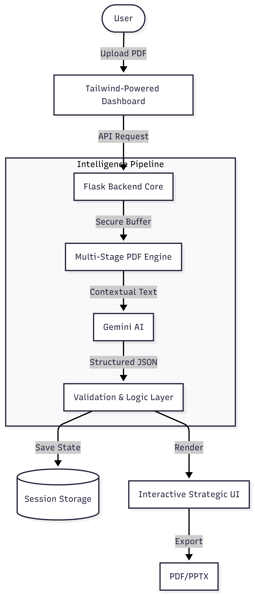

  

# AI Market Analyst Pro – Technical Documentation
*Enterprise Strategic Intelligence Platform*

---

## 1. Summary
AI Market Analyst Pro is a high-performance strategic intelligence platform designed to bridge the gap between massive, unstructured corporate data and executive decision-making. By transforming 50-100+ page annual reports and market filings into structured, visually intuitive dashboards, the platform significantly accelerates time-to-insight for consultancy and executive teams.

### Core Value Pillars:
- **Accuracy**: Multi-stage AI verification ensures that SWOT and Risk metrics are grounded in document facts.
- **Actionability**: Shifts the focus from "What happened?" to "What should we do next?" via automated strategic roadmapping.

---

## 2. Tech Stack & Integration Specs

| Component | Technology | Role |
| :--- | :--- | :--- |
| **Frontend** | Tailwind CSS + Vanilla JS (ES6+) | Responsive, high-fidelity data visualization via Chart.js. |
| **Backend** | Python / Flask | High-concurrency API orchestration. |
| **AI Engine** | Google Gemini 3.0/3.1 | Multimodal reasoning and structured data extraction. |
| **Extraction** | PyMuPDF4LLM + pdfplumber | Advanced structural analysis of complex PDF layouts. |
| **Database** | SQLite | Lightweight, localized history and session tracking. |

---

## 3. System Architecture
The platform is built on a modern, decoupled architecture designed for high availability and rapid scaling.

---

## 4. Key Implementation Features

### 🛡️ Data Privacy & Security
- **Local-First Processing**: Uploaded documents are processed in temporary, secure buffers and cleared immediately after analysis.
- **Zero-PiI Retention**: The system is designed to extract business insights without requiring or storing sensitive personal data (PII).
- **API Hardening**: All AI communications are encrypted via TLS 1.3, ensuring document context never leaks into public training sets.

### 🤖 High-Availability AI Logic
- **4-Stage Fallback Chain**: To ensure zero downtime, the system automatically cycles through `Gemini 3.0 Flash`, `3.1 Flash-Lite`, and `2.5 Flash` variants if primary quotas are hit.
- **JSON-Schema Enforcement**: Unlike basic chatbots, this engine uses strict schema enforcement to guarantee that dashboard data always matches the expected technical format.

### 📊 Professional Output Engine
- **Risk Heatmap**: Dynamically plots **Impact vs. Likelihood**, allowing executives to visually prioritize fire-drills vs. long-term strategic threats.
- **Consultancy-Grade Exports**: Generates theme-independent PDF reports that look identical on-screen and in print, featuring text-based fallbacks for charts to ensure accessibility.

---

## 5. Testing 
The platform has undergone a "Hardening Pass" to ensure stability under enterprise conditions:
- **Stress Testing**: Successfully processed 100+ page Tesla (79pg) and typical 10-K filings.
- **Error Resilience**: Implemented specialized handlers for:
    - **Scanned Documents**: Detects and warns when a PDF is merely an image (no text layer).
    - **Large Payloads**: Gracefully manages files up to 10MB with 413 error-trapping.
    - **Quota Throttling**: 429 error messages are intercepted and converted into professional "Please wait" notifications.

---

## 🚀 Future Scalability Roadmap

### Phase 1: Comparative Intelligence (Q3)
Implement "Time-Series Analysis" allowing users to upload two years of reports to see an automated "Delta Report" showing exactly where a competitor has gained or lost ground.

### Phase 2: Predictive Benchmarking (Q4)
Integrate real-time market news APIs to cross-reference report findings with "live" market sentiment, providing a "Vulnerability Score" against current economic trends.

### Phase 3: Global Multi-User SaaS
Migration to **Google Cloud Run** and **Firebase Auth** to support global logins, team-sharing of reports, and a centralized "Insights Library" for the entire organization.
